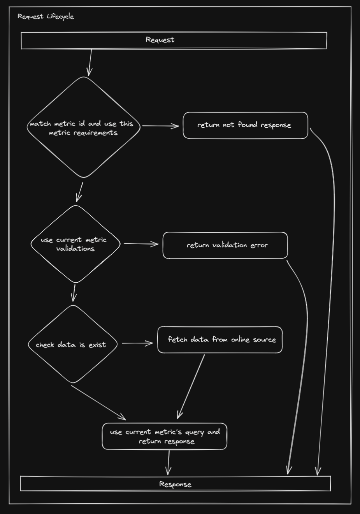

# Deno Sheet KPI

## Overview

This project has been developed for technical assigment of Datapad.
To see requirements, [click here](https://github.com/datapadofficial/assessment-backend)

## Data Source

This project uses Google Sheet as data source. [Click here](https://docs.google.com/spreadsheets/d/1frVzuJCImzpP-zEhSrzuQGV0rUp3mFxV5OfG0z1UZYg/edit?usp=sharing) to see the sheet.

## Why I Prefer Cache and MongoDB?

Because this project uses a sheet file and pulling this sheet file from google servers is both limited and time-consuming. That's why I'm caching the data. I preferred MongoDB because the data is very large and I will be operating in this data. Because MongoDB is a NoSql database and it is quite fast.

The project will update the cache periodically (this time can be changed from env variables) by going to google sheet. While updating the cache, the server will return the requests with an error.

## How to run

### Requirements

- Docker [Click here](https://docs.docker.com/get-docker/) to install Docker
- Docker Compose [Click here](https://docs.docker.com/compose/install/) to install Docker Compose

### Run Steps

1. Clone this repository
2. Copy `.env.example` to `.env`
3. Fill the `.env` file with your Google Sheet ID and Google Service Account Key
4. Run `docker-compose up`

## Customize Env Variables

| Variable               | Description                | Default                                         | Required |
| ---------------------- | -------------------------- | ----------------------------------------------- | -------- |
| SERVER_PORT            | Port to run the server     | `9000`                                          | No       |
| MONGODB_USER           | MongoDB username           | `root`                                          | No       |
| MONGODB_PASSWORD       | MongoDB password           |                                                 | Yes      |
| MONGO_DB_NAME          | MongoDB database name      | `deno-sheet-kpi`                                | No       |
| CACHE_TIMEOUT          | Cache timeout (seconds)    | `60`                                            | No       |
| SPREADSHEET_ID         | Google Sheet ID            |                                                 | Yes      |
| SPREADSHEET_URL        | Google Sheet URL           | `https://sheets.googleapis.com/v4/spreadsheets` | No       |
| SPREADSHEET_API_KEY    | Google Service Account Key |                                                 | Yes      |
| SPREADSHEET_RANGE_NAME | Google Sheet Range Name    |                                                 | Yes      |

##  Request Lifecycle



##  API Documentation

###  Avg. Revenue by Brand

####  Request

```http
GET /metrics?id=revenue&dimensions=brand&aggregate=avg
```

####  Response

```json
{
  "metric": "revenue",
  "dimensions": ["brand"],
  "aggregation": "avg",
  "data": {
    "amd": {
      "value": "185.97"
    },
    "lg": {
      "value": "189.05"
    },
    "panasonic": {
      "value": "223.94"
    },
    "sunshine": {
      "value": "347.60"
    },
    "lenovo": {
      "value": "16.40"
    },
    "samsung": {
      "value": "91.84"
    }
  }
}
```

###  Weekly Sessions

####  Request

```http
GET /metrics?id=sessions&dimensions=date.weeknum&aggregate=distinct
```

#### Response

```json
{
  "metric": "sessions",
  "dimensions": ["date.weeknum"],
  "aggregation": "distinct",
  "data": {
    "38": {
      "value": 6159
    },
    "39": {
      "value": 18529
    },
    "40": {
      "value": 18248
    },
    "41": {
      "value": 20956
    },
    "42": {
      "value": 24997
    },
    "43": {
      "value": 25008
    },
    "44": {
      "value": 6217
    }
  }
}
```

### Daily Conversion Date %

####  Request

```http
GET /metrics?id=conversion&dimensions=date&aggregate=distinct
```

#### Response

```json
{
  "metric": "conversion",
  "dimensions": ["date"],
  "aggregation": "distinct",
  "data": {
    "2020-10-11": {
      "value": "0.04",
      "sessions": 2561,
      "purchases": 97
    },
    "2020-10-16": {
      "value": "0.04",
      "sessions": 3675,
      "purchases": 147
    },
    "2020-10-12": {
      "value": "0.04",
      "sessions": 3115,
      "purchases": 126
    }
  }
}
```

### Net Revenue of Each Customer

Here, in the original assignment, the keys in the data are customerName, but since I only have userId access, we will see an int value here.

####  Request

```http
GET /metrics?id=net-revenue&dimensions=customer&aggregate=sum&filter.date.from=2020-09-10&filter.date.to=2020-09-15
```

#### Response

```json
{
  "metric": "net-revenue",
  "dimensions": ["customer"],
  "aggregation": "sum",
  "filter": {
    "date": {
      "from": "2000-01-01",
      "to": "2022-11-24"
    }
  },
  "data": {
    "1515915625521162739": {
      "value": 43.11
    },
    "1515915625528249247": {
      "value": 408.58
    },
    "1515915625526849111": {
      "value": 24.24
    },
    "1515915625528693805": {
      "value": 208.62
    },
    "1515915625521651563": {
      "value": 26.46
    },
    "1515915625529223748": {
      "value": 33.97
    }
  }
}
```

##  Project Structure

```bash
├── __readme__ # Images for readme
├── src # Application files
│   ├── config # Config files
│   ├── ├── env.ts # getRequiredEnv function
│   ├── ├── variables.enum.ts # Env variables
│   ├── database # Database files
│   ├── ├── mongo.ts # MongoDB connection and helper functions
│   ├── domains # Domains
│   ├── ├── metric # Metric domain
│   ├── ├── ├── metric.cache-service.ts # Cache service for metric
│   ├── ├── ├── metric.mapper.ts # Mapper for metric
│   ├── ├── ├── metric.schema.ts # Metric schema
│   ├── ├── ├── metric.service.ts # Metric service
│   ├── ├── ├── metric.types.ts # Metric types
│   ├── ├── ├── metric.validator.ts # Metric validator
│   ├── ├── ├── metric.router.ts # Metric router
│   ├── ├── ├── metric.repo.ts # Metric repository
│   ├── ├── ├── metric.query.ts # Metric query
│   ├── ├── ├── metric.messages.ts # Metric messages
│   ├── middlewares # Middlewares
│   ├── ├── error-handler.middleware.ts # Error handler middleware
│   ├── types # Types
│   ├── ├── validation.result.ts # Validation result type
│   ├── utils # Utils
│   ├── ├── response.ts # Response helper
│   ├── ├── router-context.ts # Router context
│   ├── main.router.ts # Main router
│── .env # Environment variables
├── .gitignore # Git ignore
├── Dockerfile # Dockerfile
├── docker-compose.yml # Docker compose file
│── main.ts # Server
```

## License

MIT

## Author

Sami Salih İbrahimbaş
